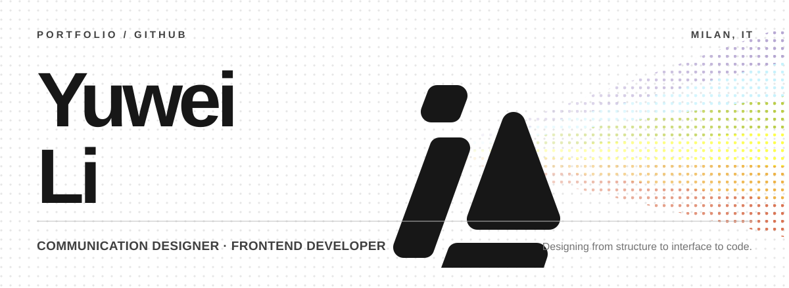

<picture>
  <source media="(prefers-color-scheme: dark)" srcset="./assets/profile-hero-dark.svg">
  <source media="(prefers-color-scheme: light)" srcset="./assets/profile-hero-light.svg">
  
</picture>

# Yuwei Li

Communication Designer & Frontend Developer based in Milan.

I work across visual identity, editorial design, UX/UI, and frontend development. My practice connects research and information architecture with interface design, content systems, implementation, and long-term maintenance.

[Portfolio ↗](https://www.yuweidesign.com) · [LinkedIn ↗](https://www.linkedin.com/in/yuwei081/) · [Email ↗](mailto:yuweidesign@outlook.com)

## Selected work 04

| Project | Scope |
| :--- | :--- |
| **01 · [Urlo Creativo](https://www.yuweidesign.com/projects/urlo-creativo)** | Frontend development, responsive adaptation, Sanity CMS structure, SEO, and ongoing maintenance for a bilingual Milan studio. Next.js · TypeScript · Tailwind CSS · Sanity [Visit website ↗](https://www.urlocreativo.com/it) |
| **02 · [Personal Website](https://github.com/Yuwei-pacific/Personal-Website)** | My portfolio and digital practice translated into a flexible editorial system. Next.js · TypeScript · Tailwind CSS · Sanity · GSAP [Visit website ↗](https://www.yuweidesign.com) |
| **03 · [E-Club Polimi](https://github.com/eclubpolimi/eclubpolimi.it)** | The official E-Club Polimi platform for its team, events, initiatives, and University Startup Challenge programmes. Astro · React · TypeScript · Tailwind CSS · Contentful [Visit website ↗](https://www.eclubpolimi.it) |
| **04 · [Cloud Atlas](https://github.com/Yuwei-pacific/Cloud-Atlas-Webcode-gruppo9)** | A scroll-driven narrative interface for exploring timelines, recurring roles, and character connections in *Cloud Atlas*. Astro · D3.js · Lenis |

## Practice

| Discipline | Working set |
| :--- | :--- |
| **Design** | Visual identity · Editorial design · UX/UI · Design systems · Information architecture |
| **Frontend** | TypeScript · React · Next.js · Astro · Tailwind CSS · Responsive development |
| **Content & infrastructure** | Sanity · Contentful · Vercel · Cloudflare |
| **Interaction & visualisation** | GSAP · D3.js · Motion prototyping · Information visualisation |

## Work with me

I’m open to freelance projects and collaborations with creative studios, agencies, cultural organisations, and design-led businesses.

[View selected work ↗](https://www.yuweidesign.com/#work) · [Start a conversation ↗](mailto:yuweidesign@outlook.com)
